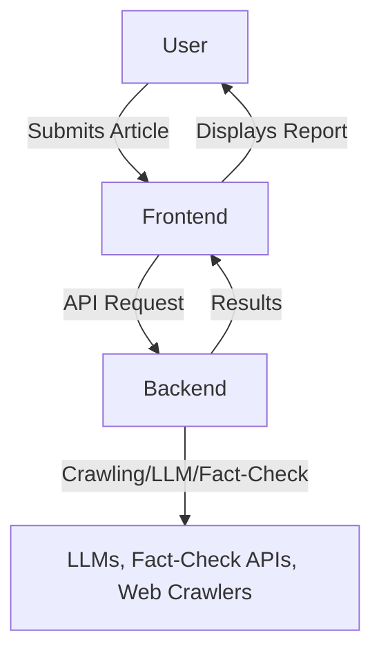

# News Veracity Detector

## Overview

**News Veracity Detector** is an advanced, AI-powered platform for analyzing the credibility of news articles. It leverages state-of-the-art language models, web crawling, and fact-checking APIs to extract, analyze, and verify claims from news content, providing users with a transparent, evidence-based credibility score and detailed report.

---

## Table of Contents
- [Features](#features)
- [Architecture](#architecture)
- [Technologies Used](#technologies-used)
- [Backend Details](#backend-details)
- [Frontend Details](#frontend-details)
- [Workflow](#workflow)
- [Setup & Installation](#setup--installation)
- [Usage](#usage)
- [License](#license)

---

## Features
- **Automated News Analysis:** Analyze articles via URL or raw text.
- **Claim Extraction:** Uses LLMs to extract factual claims from articles.
- **Bias Detection:** Detects and rates bias in news content.
- **Fact-Checking:** Verifies claims using Google Fact Check API and corroborates with trusted sources.
- **Credibility Scoring:** Assigns a transparent, multi-factor credibility score.
- **Modern UI:** Newspaper-inspired, responsive frontend for clear results presentation.

---

## Architecture



---

## Technologies Used

### Backend
- **Python 3.9+**
- **FastAPI** (API server)
- **httpx** (Async HTTP requests)
- **dotenv** (Environment variable management)
- **pydantic** (Data validation)
- **Crawl4ai**(extraction)
- **OpenAI, Together AI, Google Fact Check API**

### Frontend
- **React** (Vite-powered)
- **Framer Motion** (Animations)
- **Tailwind CSS** (Optional, for utility-first styling)
- **Custom CSS** (Newspaper theme)

---

## Backend Details

- **API Server:** Exposes endpoints for news analysis via FastAPI.
- **Analysis Pipeline:**
  1. **Ingestion:** Crawls and cleans article content (from URL or raw text).
  2. **Source Tiering:** Assigns a credibility tier to the publisher based on domain.
  3. **Deconstruction:** Uses LLMs to extract factual claims and analyze bias.
  4. **Evidence Gathering:** Fact-checks claims using Google Fact Check API and searches for corroboration in trusted sources.
  5. **Synthesis & Scoring:** Synthesizes evidence, assigns verdicts, and computes a final credibility score.
- **Asynchronous Processing:** Handles long-running analysis in the background, allowing for scalable, responsive API usage.

---

## Frontend Details

- **User Interface:**
  - Lets users submit news articles by URL or text.
  - Shows progress, results, and errors in a visually appealing, newspaper-inspired layout.
  - Displays credibility score, bias report, and claim-by-claim verdicts.
- **API Integration:**
  - Communicates with the backend for analysis requests and result polling.
  - Handles asynchronous workflows and updates UI in real time.
- **Responsive Design:**
  - Optimized for both desktop and mobile devices.
  - Print-friendly styles for sharing or archiving reports.

---

## Workflow

1. **User Submission:**
   - User enters a news article URL or pastes raw text in the frontend.
2. **API Request:**
   - Frontend sends a POST request to the backend `/analyze` endpoint.
3. **Content Ingestion:**
   - Backend crawls and cleans the article, determines publisher tier.
4. **Claim Extraction & Bias Analysis:**
   - LLM extracts factual claims and analyzes bias in the article.
5. **Fact-Checking & Corroboration:**
   - Each claim is checked against fact-checking databases and corroborated with trusted sources.
6. **Synthesis & Scoring:**
   - LLM synthesizes evidence, assigns verdicts, and computes a final credibility score.
7. **Results Delivery:**
   - Backend returns a detailed report to the frontend.
8. **User Review:**
   - Frontend displays the results in a clear, interactive format.

---

## Setup & Installation

### Prerequisites
- Python 3.9+
- Node.js (for frontend)
- API keys for OpenAI, Together AI, and Google Fact Check API

### Backend Setup
```bash
cd news_veracity_detector/news/Backend
python -m venv venv
source venv/bin/activate  # or venv\Scripts\activate on Windows
pip install -r requirements.txt
# Set up your .env file with required API keys
uvicorn api:app --reload
```

### Frontend Setup
```bash
cd news_veracity_detector/news/Fronted
npm install
npm run dev
```

---

## Usage

1. Start the backend server (see above).
2. Start the frontend development server.
3. Open the frontend in your browser (usually at `http://localhost:5173`).
4. Enter a news article URL or paste text, then click "Analyze".
5. Review the credibility score, bias report, and claim-by-claim analysis.

---

## License

This project is for educational and research purposes. For commercial or production use, please contact the maintainers.
